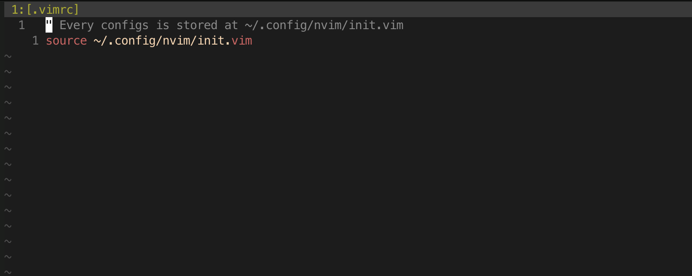
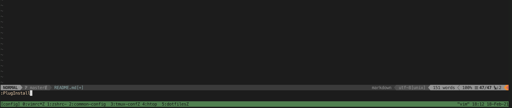

# HOANGO7604 NVIM CONFIGURATIONS

### DESCRIPTION
- This is my own nvim config (which works for both vim and neovim).
- This should be installed along with [hoango7604/dotfiles](https://github.com/hoango7604/dotfiles) (OR AT LEAST with [hoango7604/dotfiles/.vimrc](https://github.com/hoango7604/dotfiles/blob/master/config/.vimrc))

### PREREQUISITES

#### Full combination (recommended):
Clone [hoango7604/dotfiles](https://github.com/hoango7604/dotfiles) to your $HOME directory:
```
git clone git@github.com:hoango7604/dotfiles.git ~/dotfiles
```

Follow the installation instruction from dotfiles project.

#### Partially install:
Create new .vimrc file in your $HOME directory:
```
rm -rf ~/.vimrc && touch ~/.vimrc
```

Open .vimrc file, paste this content into it and then save:
```
" Every configs is stored at ~/.config/nvim/init.vim
source ~/.config/nvim/init.vim
```


### INSTALLATION
Clone this project into $HOME/.config/nvim directory:
```
git clone git@github.com:hoango7604/vim-config.git ~/.config/nvim
```

Install [Vim Plugin Manager](https://github.com/junegunn/vim-plug):
```
curl -fLo ~/.vim/autoload/plug.vim --create-dirs \
    https://raw.githubusercontent.com/junegunn/vim-plug/master/plug.vim
```

Open *vim* (just ignore all errors being shown for now):
```
vim
```

Using command __*:PlugInstall*__ (or __*\<leader\> + in*__ for shortcut) to install vim plugins:


That's all. Easy to setup and now you're ready for an exciting journey into the *VIM* world!
